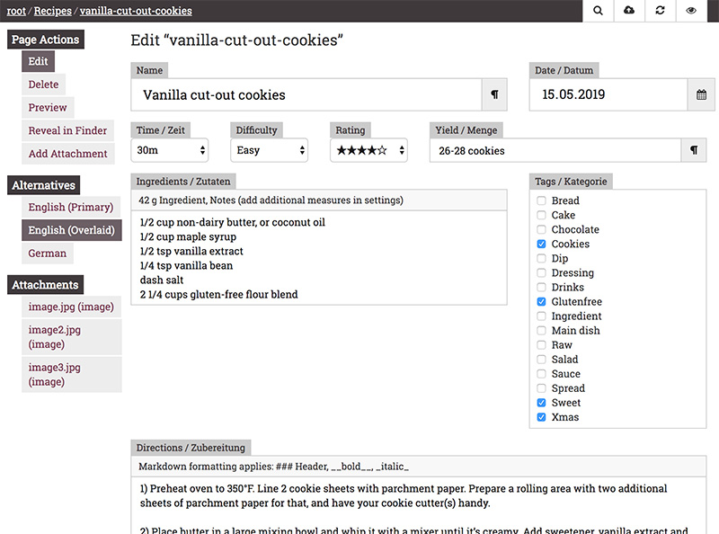

Lektor recipes
==============

Generating a static site for recipes.
Small, fast, multi-language, indexed.


Styling is optimized for desktop, mobile, and print output.
At some point I may add search filters and offline archives for mobile devices.

This project is built upon [Lektor](https://github.com/lektor/lektor/).


Install
-------

1. [Download](https://www.getlektor.com/) Lektor and follow the instructions.

2. Clone this repository and change to the `src` directory.

3. Run `lektor server` to run a local server and preview the page. **Note:** Open http://127.0.0.1:5000/en/ instead of the default `/` path.\**


### Deploy

You need to add a deployment setting to the project file.
Either apply something from the [official docs](https://www.getlektor.com/docs/deployment/),
or run a custom rsync command:

```
rsync -rclzv --delete --exclude=.* SRC DST
```

\** You don't have to worry about the redirect.
The `root/index.html` is copied to the destination.
Instead, you could also delete `root/` and change the project file.
Set `url_prefix` to `/` for one of the alternates.


### Modify

Thanks to Lektor you have a simple content management system (see screenshot below).
Two things to note:

1. Measurements have to be added manually to settings. Don't forget to __pluralize__ (c, cup, cups, etc.)

2. You can __group ingredients__ if the line ends with a colon (`:`)

Also, see [Lektor docs](https://www.getlektor.com/docs/) and [jinja2 template](https://jinja.palletsprojects.com/en/2.10.x/templates/) documentation.



